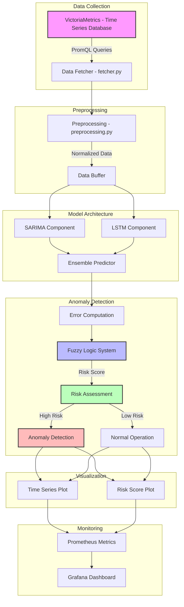

# SARIMA-EE-LSTM: Advanced Time Series Forecasting and Anomaly Detection with Fuzzy Logic Risk Assessment

A sophisticated ensemble model combining SARIMA (Seasonal AutoRegressive Integrated Moving Average) and Encoder-Enhanced LSTM (Long Short-Term Memory) for high-precision time series forecasting and anomaly detection, enhanced with fuzzy logic-based risk assessment.

## 🌟 Key Features

- **Hybrid Forecasting Architecture**: Combines SARIMA and LSTM models for robust predictions
- **Advanced Anomaly Detection**: Multi-feature anomaly detection with fuzzy logic risk assessment
- **Real-time Monitoring**: Continuous monitoring with configurable thresholds
- **Fuzzy Logic Risk Assessment**: Multi-input fuzzy system with Persian language support
- **Professional Visualization**: Advanced plotting capabilities for time series and anomalies
- **Scalability**: Handles multiple features simultaneously
- **Robust Error Handling**: Comprehensive error handling and fallback mechanisms

## 📊 Monitored Network Metrics

The system performs comprehensive analysis on the following network performance indicators:
- Network Congestion
- End-to-End Latency
- Packet Jitter
- Network Throughput
- Available Bandwidth
- Number of Active Video Streams
- Video Bitrate
- Packet Loss Rate

## 🛠️ Technical Requirements

- Python 3.8+
- PyTorch 2.0+
- NumPy 1.21+
- Pandas 1.3+
- Statsmodels 0.13+
- Matplotlib 3.4+
- Seaborn 0.11+
- Scikit-learn 1.0+

## 🚀 Installation

1. Clone the repository:
```bash
git clone https://github.com/yourusername/SARIMA-EE-LSTM.git
cd SARIMA-EE-LSTM
```

2. Install dependencies:
```bash
pip install -r requirements.txt
```

## 💻 Implementation

1. **Model Training**:
```python
from model import EELSTM, SARIMAForecaster
from preprocessing import preprocess_for_training

# Data preparation
data = load_your_data()  # Custom data loading function
processed_data = preprocess_for_training(data)

# Model initialization and training
model = EELSTM(input_dim=your_input_dim)
# Training implementation
```

2. **Prediction and Anomaly Detection**:
```python
from model import forecast, detect_anomalies

# Generate forecasts with confidence intervals
predictions, upper_bounds, lower_bounds = forecast(model, data, scaler, sarima_forecasters)

# Perform anomaly detection with fuzzy risk assessment
anomaly_results = detect_anomalies(actual_data, predictions)
```

3. **Result Visualization**:
```python
from matplotlib_utils import plot_time_series, plot_anomaly_detection

# Visualize time series with confidence intervals
plot_time_series(actual_data, predictions, feature_name="latency")

# Visualize anomaly detection results with risk scores
plot_anomaly_detection(actual_data, predictions, anomaly_results, feature_name="latency")
```

## 📈 System Architecture

### EELSTM (Ensemble Encoder LSTM)
- Multi-layer LSTM architecture with encoder enhancement
- Advanced feature extraction capabilities
- Configurable hidden dimensions and layers
- Bidirectional processing for improved accuracy

### SARIMA Integration
- Automatic parameter selection and optimization
- Seasonal and non-seasonal component analysis
- Robust error handling and validation
- Adaptive forecasting capabilities

### Fuzzy Logic Risk Assessment
- Multi-input fuzzy inference system
- Persian language support for risk levels
- Configurable risk thresholds and membership functions
- Real-time risk score computation

## ⚙️ Configuration Parameters

Key parameters in `config.py`:
- Input dimensions and sequence length
- Feature-specific thresholds
- SARIMA model parameters
- Fuzzy logic membership functions
- Risk assessment thresholds

## 📊 Visualization Capabilities

The system provides comprehensive visualizations:
- Time series forecasts with confidence intervals
- Anomaly detection results with risk scores
- Fuzzy logic membership functions
- Real-time monitoring dashboards

## 🔍 Anomaly Detection Methodology

The system employs a sophisticated multi-stage approach:
1. Statistical analysis (MSE, MAE computation)
2. Fuzzy logic risk assessment
3. Threshold-based classification
4. Persian language risk reporting
5. Confidence interval analysis

## 🤝 Contributing

We welcome contributions to enhance the system's capabilities. Please follow our contribution guidelines when submitting Pull Requests.

## 📝 License

This project is licensed under the MIT License - see the LICENSE file for details.

## 🙏 Acknowledgments

- Research community for time series forecasting approaches
- Contributors to the open-source data science ecosystem
- Academic institutions supporting this research

## 📧 Contact

For academic inquiries and research collaboration, please open an issue in the GitHub repository.




