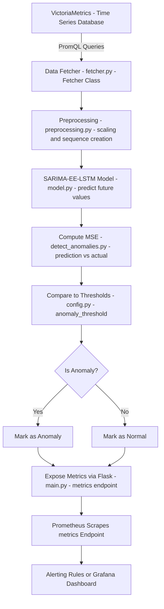

# 📊 Project: Real-Time Anomaly Detection with SARIMA-EE-LSTM

---

## 🌟 Overview
This project implements a real-time **Anomaly Detection System** for monitoring critical system features (like CPU usage, memory, etc.) using a hybrid model combining **SARIMA** (classical time-series modeling) and **LSTM** (deep learning).

The output is published via a Prometheus-compatible Flask API for visualization in **Grafana**.

---

## 🌍 Main Flow

1. **Fetch System Metrics** at regular intervals.
2. **Buffer Recent Data** into a sequence.
3. **Apply SARIMA** to predict short-term trends and get residuals.
4. **Use LSTM** on residuals to predict next-step errors.
5. **Calculate MSE** between actual and predicted residuals.
6. **Detect Anomalies** if MSE exceeds feature-specific thresholds.
7. **Forecast Future Values** and publish them.
8. **Expose Metrics** to Prometheus endpoint `/metrics`.

---

## 📅 Project Structure

| File                  | Purpose |
|------------------------|---------|
| `main.py`              | Main runner, fetches data, detects anomalies, serves metrics. |
| `model.py`             | Defines SARIMA-EE-LSTM hybrid model and forecasting methods. |
| `detect_anomalies.py`  | Contains logic for anomaly detection per feature. |
| `preprocessing.py`     | Preprocessing functions: normalization, sequence building. |
| `data_fetcher.py`      | Module to fetch latest system metrics (optional/customizable). |
| `config.py`            | Configuration parameters like intervals, thresholds, model paths, device setup. |


---

## 🎓 Module Descriptions

### `main.py`
- Loads the trained SARIMA-EE-LSTM model.
- Fetches latest data points periodically.
- Maintains a fixed-length buffer of recent values (`SEQ_LEN`).
- Calls `detect_anomaly_per_feature` to check for anomalies.
- Forecasts future values.
- Sets Prometheus metrics (anomaly flags, MSE, forecast values).
- Runs a Flask server exposing `/metrics`.


### `model.py`
- Defines `SARIMA_EELSTM`, a model that combines:
  - **SARIMA** for short-term trend estimation.
  - **LSTM** for deep learning of error patterns.
- Provides:
  - `forecast()` function to predict future steps.
  - (Optional) Functions for saving and loading models.


### `detect_anomalies.py`
- Loads the trained SARIMA-EE-LSTM model.
- For each new data batch:
  - Fits a SARIMA model and gets residuals.
  - Preprocesses residuals.
  - Predicts next-step residuals with LSTM.
  - Calculates Mean Squared Error (MSE) per feature.
  - Flags anomalies where MSE > feature threshold.


### `preprocessing.py`
- Functions for:
  - Normalizing data (mean/std scaling).
  - Creating input sequences of a given `SEQ_LEN`.
  - Inverse-transforming normalized data if needed.
  - Preparing `(X, y)` pairs for model training.


### `data_fetcher.py`
- Fetches the latest system metrics.
- You can customize it based on where your data comes from:
  - Node Exporter (Linux metrics)
  - VictoriaMetrics queries
  - Direct system calls (e.g., `psutil`)


### `config.py`
- Central location for all constants:
  - `FETCH_INTERVAL`: Time between two data fetches.
  - `FEATURES`: List of system features to monitor.
  - `MODEL_PATH`: Path to the trained model file.
  - `THRESHOLDS`: Dictionary mapping each feature to an MSE threshold.
  - `DEVICE`: `cuda` or `cpu` depending on GPU availability.


---

## 💡 Key Concepts

| Concept | Description |
|---|---|
| SARIMA | Classical statistical model capturing seasonality and trend. |
| LSTM | Deep learning model handling sequential time-series dependencies. |
| Residuals | Difference between actual and predicted SARIMA values; these are modeled by LSTM. |
| Anomaly Detection | If residual prediction MSE > threshold, the point is flagged as an anomaly. |
| Prometheus Metrics | System exports values like anomaly status, MSE, forecasts for monitoring. |


---

## 🎉 Why This Approach?
- **SARIMA** quickly captures regular, linear patterns (seasonality, trend).
- **LSTM** learns complex, nonlinear error dynamics beyond SARIMA's capability.
- Combining both gives **higher accuracy** and **fewer false alarms** than using either one alone.
- Using **Prometheus + Grafana** makes the system easy to visualize and monitor in real-time.


---

# 🚀 Quick Start

```bash
# Install required packages
pip install -r requirements.txt

# Start the monitoring service
python3 main.py

# Prometheus scrapes http://localhost:8000/metrics
# Grafana can visualize the results easily.
```

---

# 🌟 Final Thoughts
> This project provides a powerful, scalable, and smart anomaly detection system suitable for cloud servers, IoT devices, industrial systems, or any real-time environment.

Feel free to customize **data_fetcher.py** and **thresholds** to fit your application needs!




